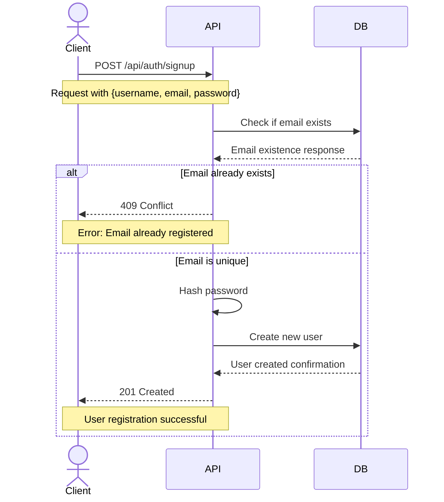
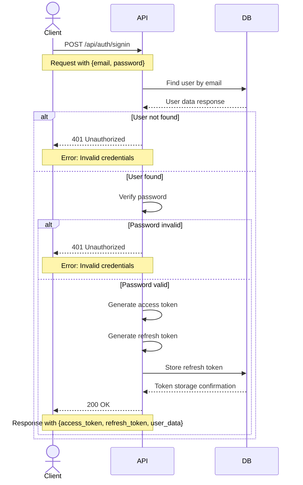
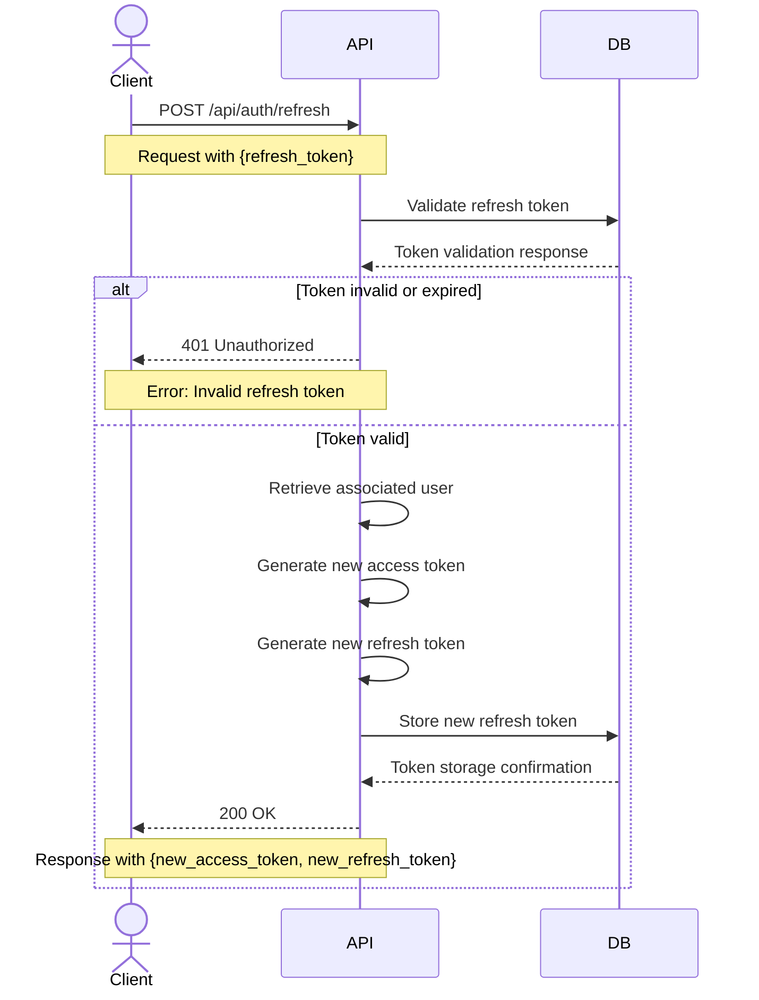
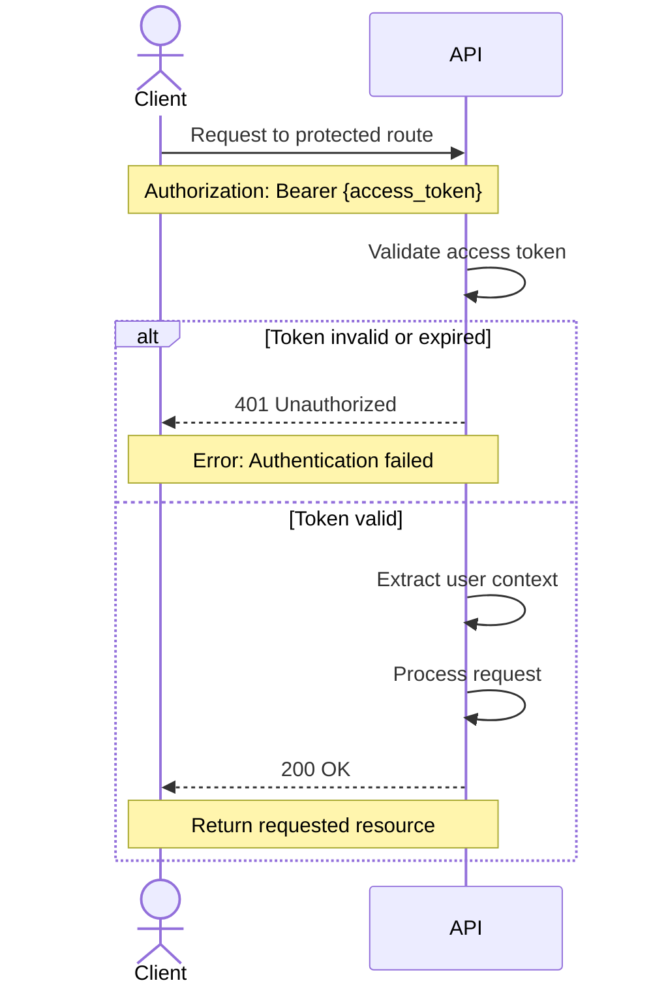
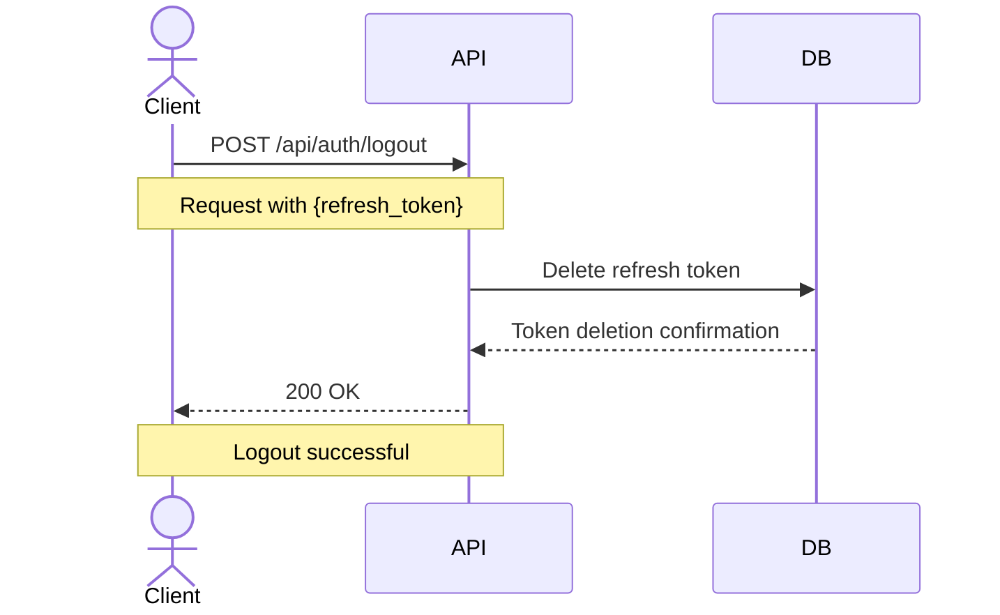

# Authentication Flow Diagrams

## Sign Up Flow

```mermaid
sequenceDiagram
    actor Client
    participant API
    participant DB
    Client->>API: POST /api/auth/signup
    Note over Client,API: Request with {username, email, password}
    API->>DB: Check if email exists
    DB-->>API: Email existence response
    alt Email already exists
        API-->>Client: 409 Conflict
        Note over API,Client: Error: Email already registered
    else Email is unique
        API->>API: Hash password
        API->>DB: Create new user
        DB-->>API: User created confirmation
        API-->>Client: 201 Created
        Note over API,Client: User registration successful
    end
```

## Sign In Flow

```mermaid
sequenceDiagram
    actor Client
    participant API
    participant DB
    Client->>API: POST /api/auth/signin
    Note over Client,API: Request with {email, password}
    API->>DB: Find user by email
    DB-->>API: User data response
    alt User not found
        API-->>Client: 401 Unauthorized
        Note over API,Client: Error: Invalid credentials
    else User found
        API->>API: Verify password
        alt Password invalid
            API-->>Client: 401 Unauthorized
            Note over API,Client: Error: Invalid credentials
        else Password valid
            API->>API: Generate access token
            API->>API: Generate refresh token
            API->>DB: Store refresh token
            DB-->>API: Token storage confirmation
            API-->>Client: 200 OK
            Note over API,Client: Response with {access_token, refresh_token, user_data}
        end
    end
```

## Refresh Token Flow

```mermaid
sequenceDiagram
    actor Client
    participant API
    participant DB
    Client->>API: POST /api/auth/refresh
    Note over Client,API: Request with {refresh_token}
    API->>DB: Validate refresh token
    DB-->>API: Token validation response
    alt Token invalid or expired
        API-->>Client: 401 Unauthorized
        Note over API,Client: Error: Invalid refresh token
    else Token valid
        API->>API: Retrieve associated user
        API->>API: Generate new access token
        API->>API: Generate new refresh token
        API->>DB: Store new refresh token
        DB-->>API: Token storage confirmation
        API-->>Client: 200 OK
        Note over API,Client: Response with {new_access_token, new_refresh_token}
    end
```

## Protected Route Flow

```mermaid
sequenceDiagram
    actor Client
    participant API
    Client->>API: Request to protected route
    Note over Client,API: Authorization: Bearer {access_token}
    API->>API: Validate access token
    alt Token invalid or expired
        API-->>Client: 401 Unauthorized
        Note over API,Client: Error: Authentication failed
    else Token valid
        API->>API: Extract user context
        API->>API: Process request
        API-->>Client: 200 OK
        Note over API,Client: Return requested resource
    end
```

## Logout Flow

```mermaid
sequenceDiagram
    actor Client
    participant API
    participant DB
    Client->>API: POST /api/auth/logout
    Note over Client,API: Request with {refresh_token}
    API->>DB: Delete refresh token
    DB-->>API: Token deletion confirmation
    API-->>Client: 200 OK
    Note over API,Client: Logout successful
```
